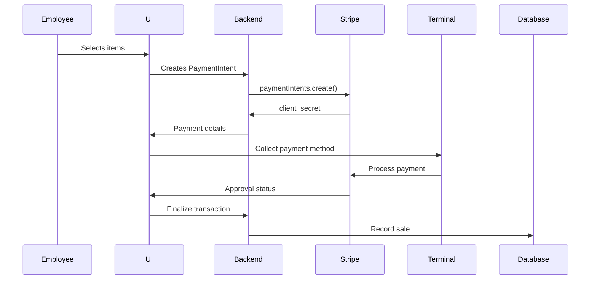

# Stripe POS Integration Guide

## Overview
This document outlines the integration of Stripe Terminal for processing in-person payments at Dink House facilities. The system allows staff to process court rentals, equipment fees, and other transactions through connected card readers.

## Workflow Scenario

### 1. Employee Login & Dashboard
- Role-based access control
- Real-time terminal connection monitoring

### 2. Creating New Transaction
- Three-panel layout:
  1. Product selection (courts/equipment)
  2. Customer management (walk-in/member)
  3. Transaction cart

### 3. Payment Processing Flow

## Technical Requirements

### Frontend Components
- `TerminalConnectionStatus.jsx`
- `ProductSelectionGrid.jsx`
- `PaymentCaptureModal.jsx`

### API Endpoints
| Endpoint | Method | Description |
|----------|--------|-------------|
| `/api/pos/payment-intents` | POST | Create new payment intent |
| `/api/pos/capture` | POST | Finalize payment capture |

## Error Handling

| Error Case | Resolution Path |
|------------|-----------------|
| Card declined | Offer alternative payment |
| Reader disconnect | Automatic reconnect flow |
| Offline mode | Queue transactions |

## Setup Instructions
1. Configure Stripe Terminal in Stripe Dashboard
2. Install `@stripe/stripe-terminal-react`
3. Implement connection token endpoint

## Testing Checklist
- [ ] Successful card payment
- [ ] Declined card flow
- [ ] Offline mode recovery
- [ ] Shift reconciliation
